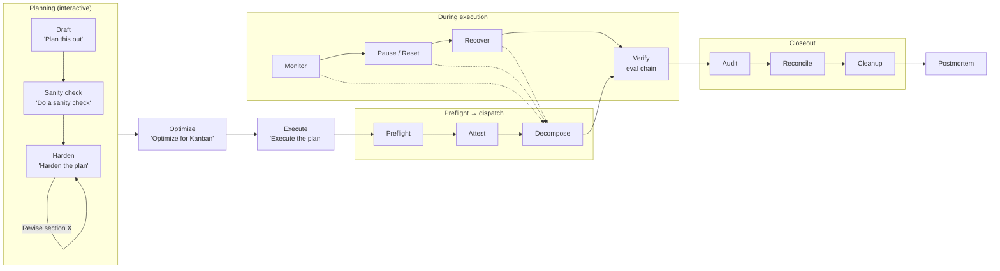
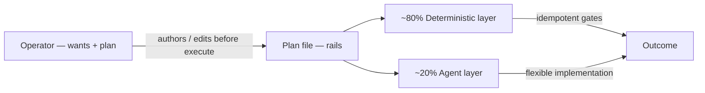
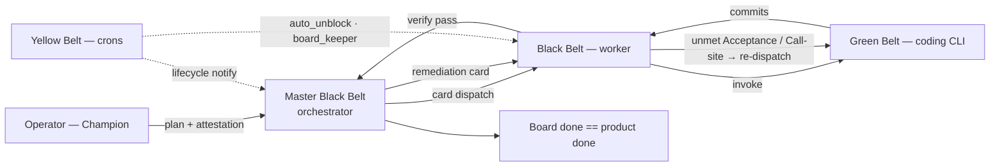

# Advanced Kanban Workflow for Hermes Agent

**Repository:** [github.com/thebizfixer/hermes-kanban-advanced-workflow](https://github.com/thebizfixer/hermes-kanban-advanced-workflow)  
**Version:** 1.0.0 · **Requires:** Python 3.12+, Hermes Agent ≥ 0.16.0 (tested on 0.17.0)  
**Platforms:** Linux · macOS · Windows (native + WSL)

A six-sigma multi-agent workflow packaged as a Hermes Agent plugin, with deterministic governance gates (AGT + AEP patterns). Environment and model agnostic.

Use for feature building, troubleshooting, fixing bugs — anything you need to plan and execute with agent KPIs and token reconciliation reporting. Ideal when you plan with Hermes Agent but hand off coding work to a headless CLI (Cursor, Claude Code, Codex, etc.).

---

## Quick Install

```bash
# 1. Install the plugin
hermes plugins install thebizfixer/hermes-kanban-advanced-workflow

# 2. Bootstrap your project (Don't Skip)
cd your-project
hermes kanban-advanced init --project-root . --working-branch <branch-name>
```

Two steps. Init creates `kanban-advanced-orchestrator` and `kanban-advanced-worker`, installs plugin SOUL prompts, seeds role-only profile skills, starts the dashboard server, and verifies the result. Replace `<branch-name>` with your integration branch (e.g. `main`). Details: [wiki/bootstrap.md](wiki/bootstrap.md).

> **Dashboard:** The plugin includes a dashboard settings tab (port 18900). The server starts automatically during init and runs while the Hermes dashboard is active. For remote/VPS setups, configure your reverse proxy to route `/api/plugins/kanban-advanced/` → `127.0.0.1:18900`.

> **Verify your installation:** Run the [standard smoke test](test-plan/kanban-standard-smoke-test.plan.md) to validate the full governance pipeline end-to-end. Copy the plan to `.hermes/kanban/plans/`, then decompose and execute. Expected: 5 cards, 8/8 tests passing, governance gates exercised, postmortem generated.

> **Coding-agent auth:** Bootstrap runs an **advisory** smoke test and writes `HOME` + `KANBAN_CODING_AGENT*` to `.env`. It does **not** add API keys or block init on auth failure. You must supply keys in `.env` or run vendor login (`agent login`, `claude login`, …) on the gateway host. **Preflight** blocks decomposition if headless auth still fails. See [coding-agent auth](plugin/data/references/coding-agent-auth.md).

> **Operator provisioning:** Init covers kanban infrastructure only (profiles, overlay, invoke scripts, kanban `.worktreeinclude` paths). Application `.env`, API keys, `.venv/`, and `node_modules/` are **your** responsibility — add to `.worktreeinclude` based on what cards run. See [operator provisioning](plugin/data/references/operator-provisioning.md).

> **Agent-driven setup?** Hand this repo link to your agent and say "set this up." See [AGENTS.md](AGENTS.md) and [llms.txt](llms.txt).

---

## What You Get

| Surface | Count | Details |
|---------|-------|---------|
| Bundled skills | 12 | `kanban-advanced:kanban-advanced` (bridge), `kanban-advanced:kanban-planning`, `kanban-advanced:kanban-orchestrator`, `kanban-advanced:kanban-worker`, `kanban-advanced:kanban-preflight`, `kanban-advanced:kanban-cleanup`, `kanban-advanced:kanban-notify`, `kanban-advanced:kanban-postmortem`, `kanban-advanced:kanban-reconciliation`, `kanban-advanced:kanban-orchestrator-governance`, `kanban-advanced:kanban-worker-governance`, `kanban-advanced:kanban-git` |
| CLI commands | 7 | `hermes kanban-advanced decompose`, `list`, `show`, `validate`, `verify-optimization`, `preflight`, `init` |
| LLM tools | 7 | `kanban_create`, `kanban_list`, `kanban_show`, `kanban_complete`, `kanban_block`, `kanban_unblock`, `kanban_link` |
| Lifecycle hooks | 2 | `on_session_start` (profile-aware skill hint), `post_tool_call` (board event JSONL + event-driven `auto_unblock` after successful `kanban_complete`) |
| Dashboard tab | 1 | Settings UI in the Hermes dashboard (`/kanban-advanced`) — configure coding agent, branch, and profiles without CLI; Save reconciles lifecycle crons when notify toggles change; mirrors `hermes kanban-advanced init` |
| Governance hooks | 2 | `worktree_setup.sh` installs pre-push (branch guard) and pre-commit (`Files:` boundary) hooks per worktree |
| Escalation chain | 1 | `kanban_escalation_tracker.sh` + `board_keeper.sh` — coding agent → worker → orchestrator → human (configurable via `escalation_max_attempts`) |

---

## Why Kanban Advanced?

Vanilla `hermes kanban` gives you a task board. This plugin adds deterministic governance: preflight gating, attestation, card body policy enforcement, a multi-step evaluation chain (ALLOW/DENY per check), automated recovery, parallel subagent pre-dispatch gate (serial fallback), board-mediated handoff for non-orchestrator profiles, lifecycle notify with resolved gateway deliver, and walk-away execution with token tracking and KPI reporting.

**Full explanation:** [Why kanban-advanced?](docs/explanation/why-kanban-advanced.md) — including when NOT to use it.

### How it works



The workflow moves through trigger phrases. You say them — the agent advances. Between stages, the agent waits for you.

| Stage | You say | What happens |
|-------|---------|-------------|
| Draft | *"Plan this out"* | Agent drafts a plan from your description |
| Sanity check | *"Do a sanity check"* | Read-only audit: verify anchors, cross-ref code, find gaps |
| Harden | *"Harden the plan"* | Agent verifies anchor points, closes gaps, adds edge cases |
| Revise | *"Revise section X"* | Iterate on harden as many times as needed |
| Optimize | *"Optimize for Kanban"* | Agent adds execution formatting, dependency graph, iteration budget |
| Execute | *"Execute the plan"* | Preflight → attest → card policy → decompose → dispatch. **Walk-away point.** |
| Reconcile | *"Yes"* (at prompt) | Compliance checks, token burn report, failure taxonomy |
| Cleanup | *"Yes"* (at prompt) | Archive board, remove crons, clean worktrees |
| Postmortem | *"Yes"* (at prompt) | Structured retrospective with KPIs and lessons learned (includes cleanup cost) |

You can pause anytime: *"Pause the plan"* blocks all cards. *"Resume the plan"* picks up where you left off. Full reference: [interaction model](docs/reference/interaction-model.md).

---

## Execution doctrine

**80% deterministic / 20% agent-driven** — you own plan intent (*what*); the plugin enforces logistics (*how* gates run). Authority chain: you author the plan → the plan sets rails → agents implement inside `Files:` → deterministic scripts gate dispatch and verify without rewriting `Acceptance:` or plan markdown.



Details — WARN vs BLOCK phases, governance layers, idempotency, escape hatches: [`plugin/data/references/execution-doctrine.md`](plugin/data/references/execution-doctrine.md) and [`wiki/governance.md`](wiki/governance.md) § Execution doctrine.

---

## Completeness role loop

Board **done** must mean product **done**. Deterministic checks (eval chain E001–E021, card policy P001–P009) are the **floor**; the belt roles form the **completeness loop** — Green Belt implements, Black Belt catches coding misses (re-dispatch on the same card), Master Black Belt catches worker misses after merge (remediation cards only; orchestrator never calls the coding CLI directly).



| Belt | Plugin mapping | Completeness job |
| --- | --- | --- |
| **Operator (Champion)** | Plan author, deploy attestation, interventions | **Define** intent — `Acceptance:` / `Call-sites:` rails the loop judges |
| **Master Black Belt** | `kanban-advanced-orchestrator` — decompose, `final_audit_sanity.py`, remediation spawn | Catch missed surfaces **after merge**; remediation card → worker only |
| **Black Belt** | `kanban-advanced-worker` — eval chain, Acceptance verify, re-dispatch | Catch coding misses **before** `kanban_complete` on the same card |
| **Green Belt** | Headless CLI (`KANBAN_CODING_AGENT`) in card worktree | Implement inside `Files:` / `Mode:`; loop back on worker send-back |
| **Yellow Belt** | `auto_unblock.sh`, `board_keeper.sh`, `cycle_detector.py`, lifecycle crons | **Control** — wave promotion, thrash detect; does not judge completeness |

**Caught** violations (worker re-dispatch or orchestrator remediation) are expected and recorded in `{plan_id}_kpi.json`. **Uncaught** violations (false completions) are sail-through failures — target **0**. DMAIC lifecycle and CTQ tree: [`wiki/six-sigma-mapping.md`](wiki/six-sigma-mapping.md) · completeness matrix: [`wiki/governance.md`](wiki/governance.md) § Role-based completeness loop.

---

## Documentation

### Getting started
- **[Tutorial](docs/tutorial/kanban-advanced-tutorial.md)** — guided walkthrough of the full lifecycle
- **[Install Guide](docs/how-to/install-as-plugin.md)** — focused installation and bootstrap

### How-to guides
- **[Governance](docs/how-to/governance.md)** — attestation, card policy, evaluation chain, policy profiles
- **[Preflight](docs/how-to/preflight.md)** — environment validation before dispatch
- **[Goal Cards](docs/how-to/goal-cards.md)** — when and how to use `--goal` mode
- **[Provider Strategy](docs/how-to/provider-strategy.md)** — multi-provider fan-out, rate limits
- **[Troubleshooting](docs/how-to/troubleshooting.md)** — common issues and fixes

### Reference
- **[Architecture](docs/reference/architecture.md)** — pipeline stages, package structure
- **[Interaction Model](docs/reference/interaction-model.md)** — trigger phrases, planning/execution/post-execution flow
- **[Configuration](docs/reference/configuration.md)** — overlay config variables, governance profile (`policy_profile`), dashboard settings UI
- **[Dashboard](dashboard/API.md)** — settings tab API reference (branches, governance profile, coding agent, profiles, max turns)
- **[Error Codes](docs/reference/error-codes.md)** — full 49-code registry with recovery (E001–E029 plus P, A, G, PR codes)
- **[KPIs](docs/reference/kpis.md)** — success rate, token burn, failure-mode distribution
- **[Personas](docs/reference/personas.md)** — orchestrator/worker roles, worker lifecycle
- **[Governance Scripts](docs/reference/scripts.md)** — evaluation chain, attestation, card policy, recovery
- **[Coding Agents](docs/reference/coding-agents.md)** — supported headless CLIs, dashboard vs worktree smoke, `coding_agent_invoke.sh`
- **[Smoke Test Plan](test-plan/kanban-standard-smoke-test.plan.md)** — end-to-end validation plan (5 cards, governance gates, postmortem)
- **[Limitations](docs/reference/limitations.md)** — what the plugin can't automate
- **[Operator provisioning](plugin/data/references/operator-provisioning.md)** — `.env`, worktrees, deps beyond bootstrap (agent SSOT)

### Explanation
- **[Why kanban-advanced?](docs/explanation/why-kanban-advanced.md)** — motivation, when not to use, three-tier tool choice
- **[Six Sigma DMAIC](docs/explanation/six-sigma-mapping.md)** — pipeline mapping to Define→Measure→Analyze→Improve→Control

### Agent-facing wiki
- **[Setup](wiki/setup.md)** — agent setup guide
- **[Configuration](wiki/configuration.md)** — detailed config reference with thinking levels
- **[Governance](wiki/governance.md)** — four gates, evaluation chain, recovery
- **[Provider Strategy](wiki/provider-strategy.md)** — rate-limit prevention, fallback configuration
- **[Troubleshooting](wiki/troubleshooting.md)** — error code → recovery mapping
- **[Six Sigma Mapping](wiki/six-sigma-mapping.md)** — DMAIC pipeline, CTQ tree
- **[External References](wiki/external-references.md)** — upstream Hermes, AGT, AEP, coding agent docs

---

## Quick Troubleshooting

| Symptom | Fix |
|---------|-----|
| Plugin doesn't load | `hermes plugins list`; restart Hermes |
| Skills not found | Use `kanban-advanced:` prefix: `skill_view("kanban-advanced:kanban-planning")` |
| CLI not found | The group is `kanban-advanced`, not `kanban` |
| Init fails on profiles | `hermes kanban-advanced init` (creates `kanban-advanced-orchestrator` + `kanban-advanced-worker`) |
| Cron scripts missing | Re-run `hermes kanban-advanced init` (preserves existing branches) |
| Working branch shows `main` after update | Set `KANBAN_PROJECT_ROOT`; use dashboard **Save** or edit `kanban-config.yaml` — [wiki/troubleshooting.md](wiki/troubleshooting.md) |
| Bootstrap OK but coding agent fails at execute | Bootstrap smoke is advisory — run `check_coding_agent_cli.py`, fix keys/OAuth/`HOME` — [coding-agent auth](plugin/data/references/coding-agent-auth.md) |
| `HOME: unbound variable` / false OAuth errors | Set `HOME=` in `.env` or gateway unit; restart gateway — [wiki/troubleshooting.md](wiki/troubleshooting.md) |
| Dashboard tab shows "Server Not Running" | Server starts automatically during init. If missing: `python3 scripts/dashboard_server.py`. Gateway must be running for keepalive cron — [wiki/troubleshooting.md](wiki/troubleshooting.md) |
| Dashboard API returns errors / won't save | Check server is running: `curl http://127.0.0.1:18900/health`. For VPS: verify reverse proxy routes `/api/plugins/kanban-advanced/` → `127.0.0.1:18900` |
| Port 18900 already in use | Set `KA_DASHBOARD_PORT=18901` in your environment; restart the server |

Full guide: [docs/how-to/troubleshooting.md](docs/how-to/troubleshooting.md)
