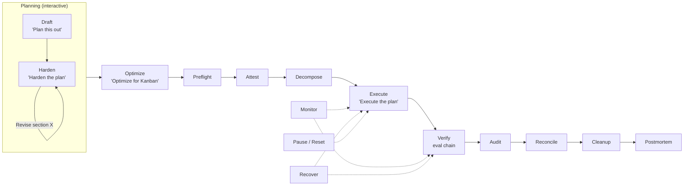

# Advanced Kanban Workflow for Hermes Agent

**Repository:** [github.com/thebizfixer/hermes-kanban-advanced-workflow](https://github.com/thebizfixer/hermes-kanban-advanced-workflow)  
**Version:** 1.0.0 · **Requires:** Python 3.12+, Hermes Agent ≥ 0.15.2  
**Platforms:** Linux · macOS · Windows (native + WSL)

A six-sigma multi-agent workflow packaged as a Hermes Agent plugin, with deterministic governance gates (AGT + AEP patterns). Environment and model agnostic.

Use for feature building, troubleshooting, fixing bugs — anything you need to plan and execute with agent KPIs and token reconciliation reporting. Ideal when you plan with Hermes Agent but hand off coding work to a headless CLI (Cursor, Claude Code, Codex, etc.).

---

## Quick Install

```bash
# 1. Install the plugin
hermes plugins install thebizfixer/hermes-kanban-advanced-workflow

# 2. Bootstrap your project (Don't Skip)
cd your-project
hermes kanban-advanced init --project-root . --working-branch <branch-name>
```

Two steps. Restart Hermes and you're ready. The init walks you through profile creation, model config, and everything else. Replace `<branch-name>` with your integration branch (e.g. `main`).

> **Agent-driven setup?** Hand this repo link to your agent and say "set this up." See [AGENTS.md](AGENTS.md) and [llms.txt](llms.txt).

---

## What You Get

| Surface | Count | Details |
|---------|-------|---------|
| Bundled skills | 10 | `kanban-planning`, `kanban-orchestrator`, `kanban-worker`, `kanban-preflight`, `kanban-cleanup`, `kanban-notify`, `kanban-postmortem`, `kanban-reconciliation`, `kanban-orchestrator-governance`, `kanban-worker-governance` |
| CLI commands | 7 | `hermes kanban-advanced decompose`, `list`, `show`, `validate`, `verify-optimization`, `preflight`, `init` |
| LLM tools | 7 | `kanban_create`, `kanban_list`, `kanban_show`, `kanban_complete`, `kanban_block`, `kanban_unblock`, `kanban_link` |
| Lifecycle hooks | 2 | `on_session_start` (auto-loads orchestrator skill), `post_tool_call` (board event logging) |

---

## Why Kanban Advanced?

Vanilla `hermes kanban` gives you a task board. This plugin adds deterministic governance: preflight gating, attestation, card body policy enforcement, a 6-step evaluation chain, automated recovery, and walk-away execution with token tracking and KPI reporting.

**Full explanation:** [Why kanban-advanced?](docs/explanation/why-kanban-advanced.md) — including when NOT to use it.

### How it works



The workflow moves through trigger phrases. You say them — the agent advances. Between stages, the agent waits for you.

| Stage | You say | What happens |
|-------|---------|-------------|
| Draft | *"Plan this out"* | Agent drafts a plan from your description |
| Harden | *"Harden the plan"* | Agent verifies anchor points, closes gaps, adds edge cases |
| Revise | *"Revise section X"* | Iterate on harden as many times as needed |
| Optimize | *"Optimize for Kanban"* | Agent adds execution formatting, dependency graph, iteration budget |
| Execute | *"Execute the plan"* | Preflight → attest → card policy → decompose → dispatch. **Walk-away point.** |
| Reconcile | *"Yes"* (at prompt) | Compliance checks, token burn report, failure taxonomy |
| Cleanup | *"Yes"* (at prompt) | Archive board, remove crons, clean worktrees |
| Postmortem | *"Yes"* (at prompt) | Structured retrospective with KPIs and lessons learned (includes cleanup cost) |

You can pause anytime: *"Pause the plan"* blocks all cards. *"Resume the plan"* picks up where you left off. Full reference: [interaction model](docs/reference/interaction-model.md).

---

## Documentation

### Getting started
- **[Tutorial](docs/tutorial/kanban-advanced-tutorial.md)** — guided walkthrough of the full lifecycle
- **[Install Guide](docs/how-to/install-as-plugin.md)** — focused installation and bootstrap

### How-to guides
- **[Governance](docs/how-to/governance.md)** — attestation, card policy, evaluation chain, policy profiles
- **[Preflight](docs/how-to/preflight.md)** — environment validation before dispatch
- **[Goal Cards](docs/how-to/goal-cards.md)** — when and how to use `--goal` mode
- **[Provider Strategy](docs/how-to/provider-strategy.md)** — multi-provider fan-out, rate limits
- **[Troubleshooting](docs/how-to/troubleshooting.md)** — common issues and fixes

### Reference
- **[Architecture](docs/reference/architecture.md)** — pipeline stages, package structure
- **[Interaction Model](docs/reference/interaction-model.md)** — trigger phrases, planning/execution/post-execution flow
- **[Configuration](docs/reference/configuration.md)** — overlay config variables
- **[Error Codes](docs/reference/error-codes.md)** — full 23-code registry with recovery
- **[KPIs](docs/reference/kpis.md)** — success rate, token burn, failure-mode distribution
- **[Personas](docs/reference/personas.md)** — orchestrator/worker roles, worker lifecycle
- **[Governance Scripts](docs/reference/scripts.md)** — evaluation chain, attestation, card policy, recovery
- **[Coding Agents](docs/reference/coding-agents.md)** — supported headless CLI agents
- **[Limitations](docs/reference/limitations.md)** — what the plugin can't automate

### Explanation
- **[Why kanban-advanced?](docs/explanation/why-kanban-advanced.md)** — motivation, when not to use, three-tier tool choice
- **[Six Sigma DMAIC](docs/explanation/six-sigma-mapping.md)** — pipeline mapping to Define→Measure→Analyze→Improve→Control

### Agent-facing wiki
- **[Setup](wiki/setup.md)** — agent setup guide
- **[Configuration](wiki/configuration.md)** — detailed config reference with thinking levels
- **[Governance](wiki/governance.md)** — four gates, evaluation chain, recovery
- **[Provider Strategy](wiki/provider-strategy.md)** — rate-limit prevention, fallback configuration
- **[Troubleshooting](wiki/troubleshooting.md)** — error code → recovery mapping
- **[Six Sigma Mapping](wiki/six-sigma-mapping.md)** — DMAIC pipeline, CTQ tree
- **[External References](wiki/external-references.md)** — upstream Hermes, AGT, AEP, coding agent docs

---

## Quick Troubleshooting

| Symptom | Fix |
|---------|-----|
| Plugin doesn't load | `hermes plugins list`; restart Hermes |
| Skills not found | Use `plugin:` prefix: `skill_view("kanban-planning")` |
| CLI not found | The group is `kanban-advanced`, not `kanban` |
| Init fails on profiles | `hermes profile create orchestrator --clone` |
| Cron scripts missing | Re-run `hermes kanban-advanced init` |

Full guide: [docs/how-to/troubleshooting.md](docs/how-to/troubleshooting.md)
