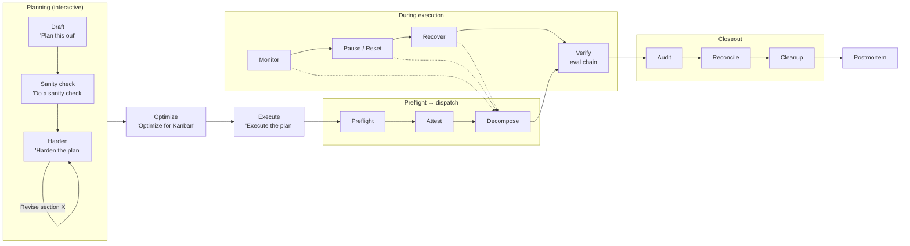
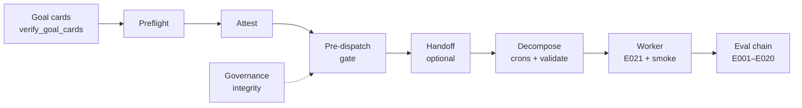

# Architecture

## Pipeline stages



## Governance layers (pre-execution through verify)

Deterministic gates run from plan hardening through worker verification. **SSOT:** [`wiki/governance.md`](../../wiki/governance.md) § Full pre-execution governance stack (check matrices, blocking vs WARN).



| Layer | Stage | Script / gate | Blocks? |
| ----- | ----- | ------------- | ------- |
| 0 | After Optimize | `verify_goal_cards.py` | Yes (via attestation) |
| 1 | Pre-decompose | `preflight.sh` → `kanban_attestation.py` | Yes (A001–A003) |
| 2 | Pre-decompose | `pre_dispatch_gate.sh` (+ OAuth pre-warm WARN) | Yes on FAIL |
| 3 | Execute (non-orchestrator) | `kanban_handoff.py` + dispatcher preconditions | Yes (exit 2–4) |
| 4 | Decompose | `provision_kanban_crons --check`, card policy, `validate_board.sh` | Yes |
| 5 | Worker Step 3 | `worktree_setup.sh`, **E021**, coding-agent smoke | Yes |
| 6 | Worker Step 6 | `kanban_evaluation_chain.py` | Yes (DENY) |

**In-flight sad-path:** [`wiki/in-flight-navigation.md`](../../wiki/in-flight-navigation.md) + [`plugin/skills/kanban-advanced/references/in-flight-governance-index.md`](../../plugin/skills/kanban-advanced/references/in-flight-governance-index.md) (Hermes `skill_view`).
| — | Plugin health (optional) | `governance_integrity.sh` | Yes |

Handoff detail (metadata, runbook, Hermes config): [`wiki/decomposition-workflow.md`](../../wiki/decomposition-workflow.md) § Board-mediated handoff.

## Stage reference

| Stage       | Trigger phrase                           | Skill                   | Governance gate                                            |
| ----------- | ---------------------------------------- | ----------------------- | ---------------------------------------------------------- |
| Draft       | `"Plan this out"`                        | `kanban-advanced:kanban-planning`       | —                                                          |
| Sanity check | `"Do a sanity check"`                   | `kanban-advanced:kanban-planning`       | Read-only audit: anchor verification, code cross-ref, gap report |
| Harden      | `"Harden the plan"`                      | `kanban-advanced:kanban-planning`       | Edge cases, contingencies, provider staggering             |
| Revise      | `"Revise section X"`                     | `kanban-advanced:kanban-planning`       | —                                                          |
| Optimize    | `"Optimize for Kanban"`                  | `kanban-advanced:kanban-planning`       | Harden (WHAT) + Optimize (HOW); then `verify_goal_cards.py` |
| Goal cards  | (before attestation)                     | `kanban-advanced:kanban-planning`       | `verify_goal_cards.py` — budget, Acceptance, agent blocks |
| Preflight   | (automatic)                              | `kanban-advanced:kanban-preflight`      | `preflight.sh` — env, gateway, profiles, coding CLI, FS (see governance wiki) |
| Attestation | (automatic)                              | `kanban-advanced:kanban-orchestrator`   | `attestation.yaml` (120 min TTL) — **mandatory** (A001–A003) |
| Pre-dispatch | (before decompose)                      | `kanban-advanced:kanban-orchestrator`   | `pre_dispatch_gate.sh` — single entry; folds preflight + attestation + infra |
| Handoff     | `"Execute the plan"` (non-orchestrator)  | `kanban-advanced:kanban-advanced`       | `kanban_handoff.py` — gate stamp, dispatcher preconditions |
| Decompose   | (automatic)                              | `kanban-advanced:kanban-orchestrator`   | Crons `--check`, card policy (P001–P009), `validate_board.sh` |
| Worker pre-exec | (per card, Step 3)                   | `kanban-advanced:kanban-worker`         | `worktree_setup.sh`, **E021**, coding-agent smoke |
| Execute     | (worker dispatch)                        | `kanban-advanced:kanban-worker`         | Preflight cache fast path (< 30 min); else full preflight |
| Verify      | (automatic)                              | `kanban-advanced:kanban-worker`         | **Evaluation chain** E001–E020 (DAL ALLOW/DENY); **E021** is Layer 5 pre-exec |
| Audit       | (automatic)                              | `kanban-advanced:kanban-orchestrator`   | 10-gate final audit                                        |
| Reconcile   | `"Yes"` (at checkpoint)                  | `kanban-advanced:kanban-reconciliation` | Error code → recovery mapping                              |
| Cleanup     | `"Yes"` (at checkpoint)                  | `kanban-advanced:kanban-cleanup`        | Board archive + cron removal                               |
| Postmortem  | `"Yes"` (at checkpoint)                  | `kanban-advanced:kanban-postmortem`     | Structured retrospective (includes cleanup cost)           |
| Recovery    | (on failure)                             | `kanban_recover.py`     | 10 automated recovery actions + cascade triage             |
| Pause/Reset | `"Pause the plan"` / `"Block and reset"` | `kanban-advanced:kanban-orchestrator`   | Blocks all cards, preserves plan file                      |

## Package structure

```
hermes-kanban-advanced-workflow/
├── plugin.yaml                       # Plugin manifest (Hermes discovers this)
├── __init__.py                       # Root proxy → plugin/__init__.py
├── plugin/
│   ├── __init__.py                   # register(ctx): wires everything
│   ├── schemas.py                    # 7 tool schemas (what the LLM sees)
│   ├── tools.py                      # 7 tool handlers (wraps hermes kanban CLI)
│   ├── hooks.py                      # on_session_start; post_tool_call (board JSONL + event-driven auto_unblock)
│   ├── cli.py                        # hermes kanban-advanced <subcommand>
│   ├── skills/                       # 12 skill subdirectories, each with SKILL.md
│   └── data/
│       ├── references/               # shared reference docs (+ skill-local index under skills/kanban-advanced/references/)
│       ├── registry/                 # error-codes.yaml
│       ├── policies/                 # card-body-policy.yaml
│       └── prompts/                  # orchestrator.md, worker.md
├── scripts/                          # Bootstrap, cron, governance scripts
├── bundles/                          # Skill bundle for non-plugin sessions
├── docs/                             # User-facing documentation
├── wiki/                             # Agent-facing reference
└── README.md
```
