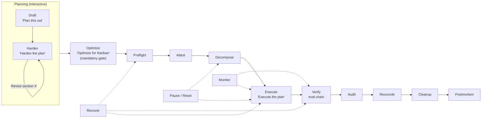

# Architecture

## Pipeline stages



## Stage reference

| Stage       | Trigger phrase                           | Skill                   | Governance gate                                            |
| ----------- | ---------------------------------------- | ----------------------- | ---------------------------------------------------------- |
| Draft       | `"Plan this out"`                        | `kanban-advanced:kanban-planning`       | —                                                          |
| Harden      | `"Harden the plan"`                      | `kanban-advanced:kanban-planning`       | Edge cases, contingencies, provider staggering             |
| Revise      | `"Revise section X"`                     | `kanban-advanced:kanban-planning`       | —                                                          |
| Optimize    | `"Optimize for Kanban"`                  | `kanban-advanced:kanban-planning`       | Harden (WHAT) + Optimize (HOW) checklists |
| Preflight   | (automatic)                              | `kanban-advanced:kanban-preflight`      | 8 checks (filesystem, profiles, gateway, etc.)             |
| Attestation | (automatic)                              | `kanban-advanced:kanban-orchestrator`   | attestation.yaml (session-scoped, 120 min) — **mandatory** |
| Decompose   | (automatic)                              | `kanban-advanced:kanban-orchestrator`   | Card body policy validation (P001-P004)                    |
| Execute     | `"Execute the plan"` / `"Proceed"`       | `kanban-advanced:kanban-worker`         | Preflight cache (fast path < 30s)                       |
| Verify      | (automatic)                              | `kanban-advanced:kanban-worker`         | **Evaluation chain** (6-step DAL, ALLOW/DENY)              |
| Audit       | (automatic)                              | `kanban-advanced:kanban-orchestrator`   | 10-gate final audit                                        |
| Reconcile   | `"Yes"` (at checkpoint)                  | `kanban-advanced:kanban-reconciliation` | Error code → recovery mapping                              |
| Cleanup     | `"Yes"` (at checkpoint)                  | `kanban-advanced:kanban-cleanup`        | Board archive + cron removal                               |
| Postmortem  | `"Yes"` (at checkpoint)                  | `kanban-advanced:kanban-postmortem`     | Structured retrospective (includes cleanup cost)           |
| Recovery    | (on failure)                             | `kanban_recover.py`     | 10 automated recovery actions + cascade triage             |
| Pause/Reset | `"Pause the plan"` / `"Block and reset"` | `kanban-advanced:kanban-orchestrator`   | Blocks all cards, preserves plan file                      |

## Package structure

```
hermes-kanban-advanced-workflow/
├── plugin.yaml                       # Plugin manifest (Hermes discovers this)
├── __init__.py                       # Root proxy → plugin/__init__.py
├── plugin/
│   ├── __init__.py                   # register(ctx): wires everything
│   ├── schemas.py                    # 7 tool schemas (what the LLM sees)
│   ├── tools.py                      # 7 tool handlers (wraps hermes kanban CLI)
│   ├── hooks.py                      # on_session_start, post_tool_call
│   ├── cli.py                        # hermes kanban-advanced <subcommand>
│   ├── skills/                       # 11 skill subdirectories, each with SKILL.md
│   └── data/
│       ├── references/               # 12 reference docs
│       ├── registry/                 # error-codes.yaml
│       ├── policies/                 # card-body-policy.yaml
│       └── prompts/                  # orchestrator.md, worker.md
├── scripts/                          # Bootstrap, cron, governance scripts
├── bundles/                          # Skill bundle for non-plugin sessions
├── docs/                             # User-facing documentation
├── wiki/                             # Agent-facing reference
└── README.md
```
