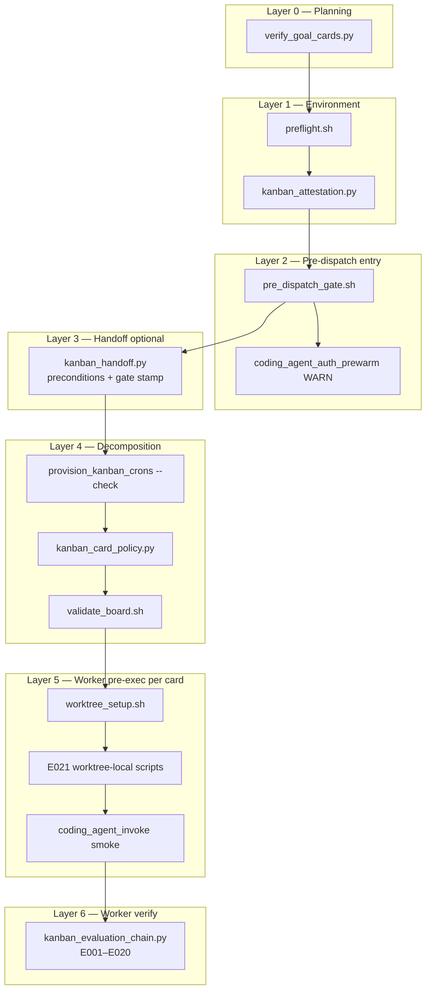
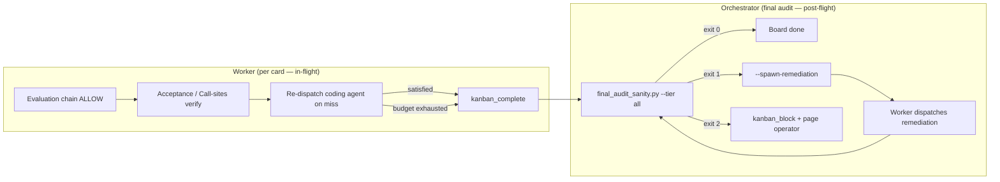

# Governance Model

> **For the agent:** When a user asks "why did my card get blocked?" or "what does the evaluation chain do?" or "how do I change the policy level?", answer from this page.

The kanban-advanced plugin uses deterministic gates — not prompt-level instructions — to prevent governance violations. A worker CANNOT skip verification. An orchestrator CANNOT skip preflight. Cards CANNOT dispatch without required fields.

## Supervisor sad-path (three steps)

1. **Rail hit** — DENY, gate FAIL, block with `E0xx` / `[escalation:…]`.
2. **Tier 2** — `skill_view("kanban-advanced:kanban-*-governance")` + [`in-flight-governance-index.md`](../plugin/skills/kanban-advanced/references/in-flight-governance-index.md).
3. **Tier 3** — this page (matrices), [`in-flight-navigation.md`](in-flight-navigation.md), [`troubleshooting.md`](troubleshooting.md).

Workers in worktrees: index + governance skills first — do not assume `wiki/` is in cwd.

**Canonical map:** this section is the single source of truth for the full stack (plan → worker). User-facing summary: [`docs/reference/architecture.md`](../docs/reference/architecture.md) § Governance layers. Script implementations: [`docs/reference/scripts.md`](../docs/reference/scripts.md).

## Execution doctrine

**80% deterministic / 20% agent-driven** — operator owns plan intent; plugin enforces logistics only. Full SSOT: [`execution-doctrine.md`](../plugin/data/references/execution-doctrine.md).

| Phase | Scripts | `advisory` | `balanced` / `strict` |
| --- | --- | --- | --- |
| Decompose dry-run | `kanban_decompose --dry-run` | WARN malformed `Tests:` / paths | WARN (no board writes) |
| Pre-dispatch | `pre_dispatch_gate.sh`, `validate_board.sh`, `kanban_card_policy.py` | WARN + allow | BLOCK on P001–P014, E-codes |
| Complete / audit | eval chain, final audit | WARN tier gaps | BLOCK verify-deploy without attestation (planned) |

Sanitizers (`Tests:` parenthetical strip, `Files:` mode-suffix normalize) change **logistics**, not `Acceptance:` prose. Re-run gates after plan edits — outcomes must be idempotent.

## Full pre-execution governance stack

Layers run in order before implementation cards dispatch workers. **Blocking** layers exit non-zero; **WARN** layers log and continue.



### Layer summary

| Layer | DMAIC | When | Script / skill | Blocks decomposition? |
|-------|-------|------|----------------|------------------------|
| 0 Planning | Define | After Optimize, before attestation | `verify_goal_cards.py` | Yes — attestation embeds result |
| 1 Environment | Control | Before attestation | `preflight.sh` → `kanban_attestation.py` | Yes — A001/A002 or attestation `fail` |
| 2 Pre-dispatch | Control | Before decomposition (or at handoff build) | `pre_dispatch_gate.sh` | Yes — any FAIL check |
| 3 Handoff | Control | Non-orchestrator *"Execute the plan"* | `kanban_handoff.py` | Yes — exits 2–4 if preconditions fail |
| 4 Decomposition | Control | Before gate complete / impl release | crons `--check`, card policy, `validate_board.sh` | Yes — orchestrator must not complete gate |
| 5 Worker pre-exec | Measure | Worker Step 3, per card | `worktree_setup.sh`, E021, smoke | Yes — E021 / smoke block card |
| 6 Worker verify | Measure | Before `kanban_complete` | `kanban_evaluation_chain.py` | Yes — DENY stops complete |

**Hermes upstream (not optional):** `kanban.auto_decompose=false`, `kanban.dispatch_in_gateway=true` for handoff, block-on-create for gate/impl/audit. See **[[decomposition-workflow]]**.

### Layer 0 — Goal cards (`verify_goal_cards.py`)

Run before attestation (planning skill step 17):

```bash
python hermes-kanban-advanced-workflow/scripts/verify_goal_cards.py --plan <plan>.md
```

Counts structured YAML (`workstreams[].goal_card`) and standalone `goal_card: true` under `###` sections only — **not** markdown table prose. Feeds `kanban_attestation.py` `goal_cards` summary.

### Layer 1 — Preflight + attestation

**Preflight** (`preflight.sh`) — JSON output; embedded in pre-dispatch gate as WARN unless `pass` or `degraded`:

| Check | Typical severity |
|-------|------------------|
| `memory_budget` | blocking / degraded |
| `hermes_version` (≥ 0.16.0, `--goal`) | blocking |
| `filesystem_coherence` | blocking (E011 cross-mount) |
| `kanban_db_integrity` | blocking / degraded |
| `secret_availability` | blocking |
| `api_reachability` | degraded |
| `gateway_health` | blocking |
| `profile_availability` | blocking |
| `model_reachability` (Hermes profiles) | blocking / degraded |
| `coding_agent_cli_reachability` | **blocking** (separate from Hermes profile ping) |
| `environment_parity` | blocking / degraded |
| `token_log` / `token_tracker_import` | degraded |
| `plan_backup` | degraded |

**Attestation** — session lock (120 min TTL):

```bash
bash hermes-kanban-advanced-workflow/scripts/preflight.sh > /tmp/preflight.json
python hermes-kanban-advanced-workflow/scripts/kanban_attestation.py <plan_id> --preflight-result /tmp/preflight.json
```

Records preflight summary, profile validity, agent-block count, goal-card verification. Error codes: **A001** (missing), **A002** (stale), **A003** (tampered).

Bootstrap/dashboard coding-agent smoke is **advisory** only; preflight + pre-dispatch gate **block**. See **[[bootstrap]]** § Coding-agent auth.

### Layer 2 — `pre_dispatch_gate.sh` (single entry)

Replaces legacy Steps 0a–0e. One command:

```bash
bash hermes-kanban-advanced-workflow/scripts/pre_dispatch_gate.sh <plan_id>
```

| # | Check | Result |
|---|--------|--------|
| 1 | `plan on ${working_branch}` | **FAIL** |
| 2 | `plan pushed` (origin up to date) | WARN |
| 3 | `preflight` (JSON pass or degraded) | WARN |
| 4 | `coding_agent_cli` (`check_coding_agent_cli.py`) | **FAIL** |
| 5 | `attestation` (`kanban_attestation.py --verify`) | **FAIL** |
| 6 | `card_policy_script` present | WARN |
| 7 | `plan_memory` (`{plan_memory_path}/{plan_id}.json`) | **FAIL** |
| 8 | `kanban_db` integrity | **FAIL** |
| 9 | `cron_scripts` executable under `$HERMES_HOME/scripts/` | **FAIL** |
| 10 | `cron_hermes_path` (`hermes` on PATH) | **FAIL** |
| 11 | `gateway_running` | WARN |
| 12 | `coding_agent_auth_prewarm` (OAuth flock + smoke) | WARN (after blocking checks pass) |

`kanban_handoff.py` runs serial gate at card creation when parallel gate is disabled (`pre_dispatch_gate: PASSED at …`). When parallel gate is enabled (default), it stamps `pre_dispatch_gate: DEFERRED at …` and `parallel_gate: enabled` — orchestrator runs Step 1 from the handoff runbook. Handoff cards with `PASSED` skip re-run; `DEFERRED` runs parallel Step 1 only.

**Parallel path (default):** When `subagent_gate.enabled` is not `false` and the orchestrator profile has the `delegation` toolset, run plan/env/infra checks via Hermes `delegate_task` in parallel, then attestation + prewarm serially. Blocking/warning severities match the table below. Serial `pre_dispatch_gate.sh` is fallback when parallel is disabled, delegation is missing, or E022 fires. See `plugin/data/references/parallel-subagent-gate.md` and `wiki/configuration.md` § `subagent_gate`. Sad-path: E022.

### Layer 3 — Handoff preconditions (`kanban_handoff.py`)

When a non-orchestrator profile triggers execution. Stamps `BUNDLE_ROOT`, `gate_script`, `cards_yaml`, `pre_dispatch_gate`, and `parallel_gate`. See **[[decomposition-workflow]]** § Board-mediated handoff.

| Check | Exit if fail |
|-------|----------------|
| Orchestrator profile exists | 2 |
| Gateway running | 3 |
| `kanban.dispatch_in_gateway` true | 4 |
| `kanban.auto_decompose` false | 4 |

`--allow-offline` bypasses 3/4; card may sit `ready` until dispatcher resumes.

### Layer 4 — Decomposition gates

Before implementation cards release (orchestrator runbook):

1. `provision_kanban_crons.sh --create` then **`--check`** (deliver=local, no_agent)
2. `kanban_card_policy.py` on card bodies (**P001–P009**)
3. **`validate_board.sh`** — fail closed before gate complete

### Layer 5 — Worker pre-execution (per card, not eval-chain)

Skill-time waypoints in `kanban-advanced:kanban-worker` Step 3 — **E021 is not an evaluation-chain step**.

| Waypoint | Check |
|----------|--------|
| 1 | Heartbeat thread |
| 2 | Governed `worktree_setup.sh` (not raw `git worktree add`) |
| 3 | **E021** — worktree-local `.hermes/scripts/coding_agent_invoke.sh` |
| 4 | `.kanban-scope` written |
| 5 | Integration freshness vs `${working_branch}` |
| 6 | `coding_agent_invoke.sh smoke` (blocking) |

Fast path: `.hermes/kanban/preflight_cache.json` &lt; 30 min (E012 if stale). Model tier advisory at Step 1 Orient — non-blocking.

### Layer 6 — Evaluation chain (worker verify)

See **§ 4. Evaluation chain** below. Codes **E001–E020** only; complete via `kanban_evaluation_chain.py` before `kanban_complete`.

### Plugin integrity (optional smoke)

When plugin/update is suspect, before any plan run — full test matrix: [[plugin-verification]].

```bash
bash hermes-kanban-advanced-workflow/scripts/governance_integrity.sh
```

~30 checks: materialized skills, scripts executable, registry, policies/prompts.

## Decomposition workflow (why block-on-create)

Before the four governance gates run at dispatch time, cards must be created safely on the vanilla Hermes board. See **[[decomposition-workflow]]** for the full justification agents should use when answering:

- Why cards are **blocked immediately after create** (dispatcher claims `ready` in <1s; parent links cannot retroactively stop a claimed card)
- Why **`kanban.auto_decompose=false`** (v0.15.0 default would LLM-rewrite optimized plan bodies)
- Why the **gate card is orchestrator-only** (complete after `validate_board.sh`, not a human approval step)
- Why we avoid `--triage`, `--parents`, and `--initial-status blocked` on dependent cards

Structural summary: create → block → link → crons → validate → orchestrator completes gate → `auto_unblock.sh` releases waves as parents reach `done`.

## The four gates

### 1. Attestation (orchestrator-side)

Before creating any cards, the orchestrator generates `attestation.yaml`:
```bash
python hermes-kanban-advanced-workflow/scripts/kanban_attestation.py <plan_id>
```

The attestation records: preflight status, profile validity, agent-prompt block count. Session-scoped (120 min TTL). Without a valid attestation, the decomposer refuses to create cards.

Error codes: A001 (missing), A002 (stale), A003 (tampered).

**Card attestation (verification-deploy only):** Separate from session attestation. When a card uses `Type: verification-deploy` or includes a `Deploy:` line, the orchestrator must write a JSON file before the card may archive:

```text
.hermes/kanban/card-attestations/{plan_id}-{card_key}.json
```

Minimum fields: `plan_id`, `card_key`, `attested_at`, `operator`, `evidence` (URL, screenshot path, or deploy log excerpt). The evaluation chain blocks completion until this file exists. Session `attestation.yaml` does **not** satisfy deploy gates.

Plan memory may also store `acceptance_matrix` (surface slots + presentation acceptance bullets) at decompose time — `final_audit.py` warns when presentation acceptance is declared in the plan but memory is empty.

### 2. Card body policy (orchestrator-side)

After creating cards but before dispatch, every card body is validated:
```bash
python hermes-kanban-advanced-workflow/scripts/kanban_card_policy.py --all --profile balanced
```

Cards must have:
- `Files:` line — every file the agent touches
- `agent -p` fenced block — the exact command the worker executes
- `Mode:` line — `modify-only`, `create-only`, or `any`

Cards with >3 files require human approval.

Error codes: P001 (missing Files:), P002 (missing agent block), P003 (missing Mode:), P004 (too many files).

### 3. Board validation (orchestrator-side, pre-dispatch)

Before the orchestrator completes the gate card, the structural board validator checks 10 governance rules:
```bash
bash hermes-kanban-advanced-workflow/scripts/validate_board.sh
```

| Check | What it catches | Error |
|-------|----------------|-------|
| 1 | Orphaned --parents declarations | P008 |
| 2 | Code-gen cards with scratch workspace | P006 |
| 3 | Shared workspace paths | P007 |
| 4 | Missing parent links | — |
| 5 | Cards running before parents done | — |
| 6 | Function-count heuristic (>10 fns) | P009 |
| 7 | Max-retries ≤2 | — |
| 8 | Orphaned agent processes | — |
| 9 | Worker cards without agent -p blocks | P002 |
| 10 | Orchestrator-only cards on worker profiles | — |

### 4. Evaluation chain (worker-side)

Before a worker can call `kanban_complete`, it must pass the evaluation chain:

```bash
# Standard invocation (auto-complete/auto-block):
python hermes-kanban-advanced-workflow/scripts/kanban_evaluation_chain.py <task_id> <workspace>

# Check-only mode (retry-safe — exit 0/1, no side effects):
python hermes-kanban-advanced-workflow/scripts/kanban_evaluation_chain.py <task_id> <workspace> --check-only
```

`--check-only` (added 2026-06-25) runs all eval steps and reports pass/fail without calling `kanban block` or `kanban complete`. Workers retry up to 3× with `--check-only` before blocking (matches `kanban.failure_limit`). See `eval-chain-retry-hardening` plan.

**Cold path (coding cards):**

| Step | Check | Error code |
|------|-------|------------|
| 1 | Every `Files:` path has >0 diff (or prior commit with matching message + diff-tree) | E001 |
| 2 | No unlisted file changes (auto-reverted) | E002 |
| 3 | `Tests:` command passes | E003 |
| 4 | Commit message matches `Commit:` line (skipped for N/A / verification) | E004 |
| 5 | Exact token log entry (`source=agent`, matching task_id) | E018 |
| 6 | At least one file has >0 diff (or `already_committed`) | E006 |
| 7 | Net line churn within budget | E017 |
| 8 | Agent output JSON captured | E020 |
| 9 | No destructive git ops in reflog (governance artifact resets skipped) | E019 |

**Verification path (`Type: verification` / `verification-local`):** runs steps 3 + 9 only — no coding-agent dispatch, no diff/token checks. Use `Tests:` + `Commit: N/A`; no `Files:` or agent blocks (`validate_board.sh` enforces at decomposition). The eval chain resolves the main project root for test execution (not the worktree), ensuring committed state is tested. Verification cards with attractor cache hits skip all steps except tests + destructive-git (E019).

**Verification-deploy (`Type: verification-deploy` or `Deploy:` line):** orchestrator-only assignee; no worker dispatch. Requires card-attestation JSON (`.hermes/kanban/card-attestations/{plan_id}-{card_key}.json`) before archive. See **Card attestation** above and `frontend-neutrality.md`.

**Presentation acceptance (layout / a11y):** When agent blocks declare `Acceptance (layout):`, `Acceptance (presentation):`, or `Acceptance (a11y):`, the evaluation chain runs `kanban_layout_acceptance.sh` / `presentation_acceptance.py` — **E028** / **E029** on failure.

**Policy carve-outs:** `Type: orchestrator-handoff`, `Type: verification`, `verification-local`, and `verification-deploy` exempt from P001–P003 where policy allows test-only / operator gates.

Direct `kanban_complete` without the chain is a protocol violation.

## Worker self-guard (runtime)

**E021 — worktree incomplete:** Step 3 blocks when worktree-local kanban scripts are missing (raw `git worktree add` bypass). Re-run `worktree_setup.sh`. See **§ Layer 5** above.

**E014 — orchestrator-only:** If the card has **neither** an `agent -p` block **nor** a `Files:` line, complete without spawning an agent (gate, audit, root).

**Verification-only (`Type: verification` / `verification-local`):** Takes precedence over any `agent -p` block at runtime — run `Tests:` via `terminal()` only, no `coding_agent_invoke.sh`, then the evaluation chain before `kanban_complete`. At decomposition, `validate_board.sh` rejects verification cards that still carry `Files:` or `agent` blocks.

**Verification-deploy:** Orchestrator profile only. Workers must not complete until `.hermes/kanban/card-attestations/{plan_id}-{card_key}.json` exists (operator deploy smoke). Evaluation chain blocks archive without attestation.

**Layout / a11y (`Acceptance (layout|presentation|a11y)`):** Evaluation chain step runs grep-verifiable DOM/motion checks — **E028** / **E029**. Overlay `ui_stack` supplies host path globs (`wiki/configuration.md`).

Error code: E014 (ORCHESTRATOR_CARD_ON_WORKER / verification contradictions on malformed cards); E028/E029 for presentation acceptance.

## Auto-progression (mechanical wave unblocking)

LLM orchestrators cannot poll the board autonomously. Wave progression (checking parent completion → unblocking children) is delegated to a script:
```bash
bash hermes-kanban-advanced-workflow/scripts/auto_unblock.sh
```
Run via cron every 60s during execution. Handles every wave transition without orchestrator intervention.

**Event-driven complement:** `plugin/hooks.py` `post_tool_call` also fires `auto_unblock.sh --max-unblock 1` after each successful `kanban_complete`, so the next wave can release without waiting for the next cron tick.

### Role-based completeness loop

After workers finish, the board is not "done" until every declared surface is verified. Violations are **caught** (good) vs **uncaught** (sail-through failure).



| Actor | Catches | KPI bucket |
|-------|---------|------------|
| Worker (scope E002, pre-complete verify) | Unlisted files, missed Acceptance before complete | `worker_catch_count` |
| Orchestrator (final audit remediation cards) | Missed surfaces after merge | `orchestrator_catch_count` / `remediation_cards_issued` |
| Uncaught | Surfaces shipped without catch | `uncaught_violation_count` — **must be 0** for sail-through (`null` when tier JSON absent = unknown) |

**Tier 1 ↔ E001:** Post-flight `plan_file_zero_diff` reuses the same `find_prior_commit` helper as eval-chain step 1 — a done card's `Commit:` + `Files:` can clear zero-diff plan paths that E001 already allowed in-flight. See `plugin/data/references/final-audit-sanity-check.md` § Tier 1 ↔ in-flight.

Postmortem writes `{plan_id}_kpi.json` + appends `kpi_history.jsonl`. Cross-plan patterns land in `.hermes/kanban/memory/_global.json` via `scripts/lib/cross_plan_memory.py`.

### Hard-stop rule (walk_away_mode: false)

When `walk_away_mode: false` in `.hermes/kanban-overrides/kanban-config.yaml`, the orchestrator MUST NOT archive, cleanup, or run postmortem after final audit. These actions are operator-driven via the default profile. Silently finishing or skipping checkpoints without walk-away mode is a governance violation. The `kanban_walk_away_post_exec.sh` script enforces this by refusing to run (exit 2) when walk-away is not enabled. Only the operator may archive and reconcile.

See also: [`docs/explanation/why-kanban-advanced.md`](../docs/explanation/why-kanban-advanced.md) § Completeness loop.

### Board keeper (proactive salvage)

A second cron runs every 180s for proactive board management:
```bash
bash hermes-kanban-advanced-workflow/scripts/board_keeper.sh
```

5 functions: salvage iteration-limit cards (check worktree for commits → merge → complete), kill orphaned agent processes, unstick ready cards stalled >3 minutes, merge completed worktree branches, report board status. Runs as **script-only** Hermes cron (`no_agent=true`, `deliver=local`).

### Cron governance (hardened in v1.1)

**Lifecycle:** Init/bootstrap materializes **script files** only. **Cron jobs** are created per plan at **execute/handoff** (`kanban_handoff.py` → `provision_kanban_crons.sh --create`), verified at orchestrator decomposition (`--check`; handoff decompose uses `--no-crons`), and removed at cleanup (`--remove`). Gateway must run for ticks; messaging platforms are optional.

| Layer | When | Checks |
|-------|------|--------|
| `pre_dispatch_gate.sh` | Before decomposition | Plan on branch, preflight, coding-agent CLI, attestation, plan memory, DB, cron scripts executable, hermes on PATH; **coding_agent_auth_prewarm** (WARN after pass) |
| Decomposition Steps 3–5 | Before impl cards | `provision_kanban_crons.sh --check` (create only if handoff skipped or `--check` fails) |
| `validate_board.sh` check 0 | Before completing gate | `provision_kanban_crons.sh --check` (active, deliver=local, no-agent) |

**Why hermes PATH matters:** Cron jobs run in a minimal environment. If `hermes` is at `~/.local/bin/hermes` but cron's PATH doesn't include `~/.local/bin`, `auto_unblock.sh` and `board_keeper.sh` will fail silently. The gate checks for this before any cards are dispatched.

**Why executable matters:** `provision.sh` does `chmod 755`, but a stale copy or manual edit can strip the executable bit. A non-executable cron script fails silently on every tick — no error, no notification, no wave progression. The gate catches this.

## Lattice memory

After a successful evaluation chain run, the (task_id, files, tests) tuple is cached. Attractor fast-path re-runs steps 2, E018, E020, 6, E017, E019 — skipping 1, 3, 4. Verification cards use a separate short path (tests + E019 only).

**Error attractors (E023):** When a code card fails the cold path, the error signature (files + tests hash) is written to lattice memory. On the next run, if the same signature appears again, the eval chain short-circuits with `E023_REPEATED_IDENTICAL_ERROR` — telling the worker to escalate rather than re-loop. This prevents the 5–12 reblock thrash pattern observed in smoke-test runs. The board-keeper's 5-loop conversation cap provides a second line of defense: after 5 identical error blocks, the card is force-escalated to the orchestrator.

## Recovery

When any gate fails:
```bash
python hermes-kanban-advanced-workflow/scripts/kanban_recover.py <task_id> <error_code>
python hermes-kanban-advanced-workflow/scripts/kanban_recover.py --cascade   # multi-failure triage
python hermes-kanban-advanced-workflow/scripts/kanban_recover.py --list      # all recovery actions
```

Recovery order for cascades: environment → agent → governance infra → verify.

## Changing policy level

**Persistent (recommended):** set at init or in the dashboard **Governance profile** dropdown. Writes `policy_profile` to `kanban-config.yaml` and `KANBAN_POLICY_PROFILE` to the project `.env`.

```bash
hermes kanban-advanced init --policy-profile strict
# or edit kanban-config.yaml: policy_profile: "strict"
```

**Per-run override:**

```bash
KANBAN_POLICY_PROFILE=strict python hermes-kanban-advanced-workflow/scripts/kanban_card_policy.py --all
bash hermes-kanban-advanced-workflow/scripts/validate_board.sh --profile strict
```

The same profile applies to card body policy, the evaluation chain, and board/plan validation gates.

## Design sources

This model adopts patterns from:
- [Microsoft Agent Governance Toolkit](https://github.com/microsoft/agent-governance-toolkit) (MIT) — `govern()` decorator, attestation gate, policy profiles
- [AEP — Agent Element Protocol](https://github.com/thePM001/AEP-agent-element-protocol) (Apache-2.0) — Deterministic Adjudication Lattice, error registry, lattice memory
